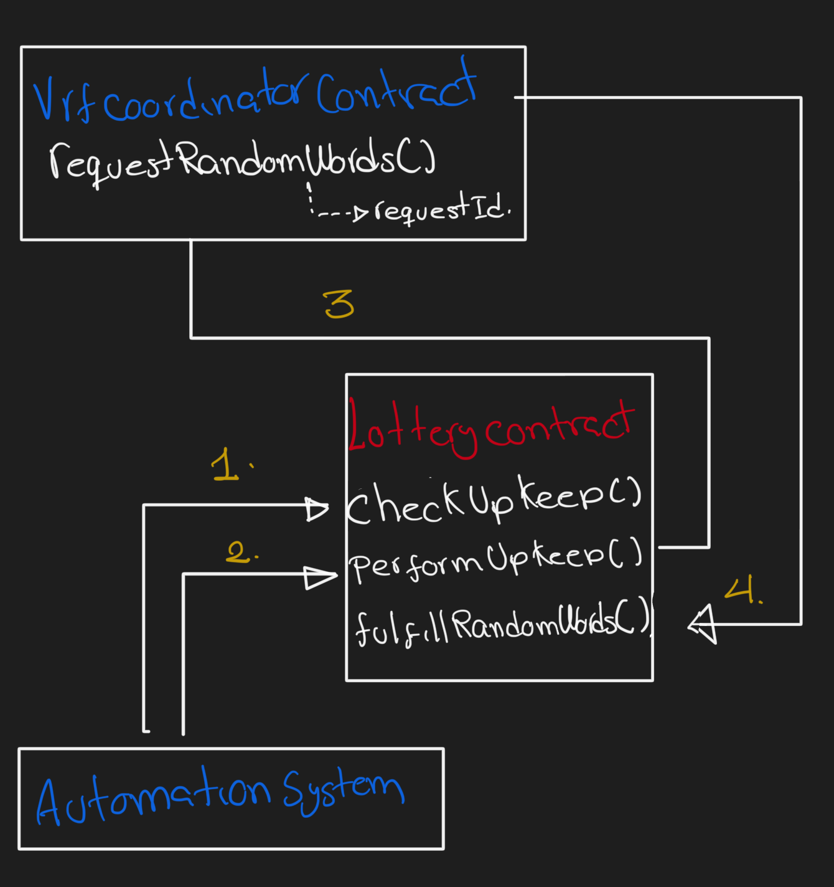

## Foundry

**Foundry is a blazing fast, portable and modular toolkit for Ethereum application development written in Rust.**

Foundry consists of:

-   **Forge**: Ethereum testing framework (like Truffle, Hardhat and DappTools).
-   **Cast**: Swiss army knife for interacting with EVM smart contracts, sending transactions and getting chain data.
-   **Anvil**: Local Ethereum node, akin to Ganache, Hardhat Network.
-   **Chisel**: Fast, utilitarian, and verbose solidity REPL.

## Documentation

https://book.getfoundry.sh/

## Usage

### Build

```shell
$ forge build
```

### Test

```shell
$ forge test
```

### Format

```shell
$ forge fmt
```

### Gas Snapshots

```shell
$ forge snapshot
```

### Anvil

```shell
$ anvil
```

### Deploy

```shell
$ forge script script/Counter.s.sol:CounterScript --rpc-url <your_rpc_url> --private-key <your_private_key>
```

### Cast

```shell
$ cast <subcommand>
```

### Help

```shell
$ forge --help
$ anvil --help
$ cast --help
```


# Smart Contract lottery project.

### Logic

This is a lottery where anybody can enter with a minimum amount fee```entranceFee```, after some conditions an account is choosen to receive the total of funds

To get a random value to choose a winner account this project uses Chainlink VRF.
To start the winner selection process this project also uses Chainlink Automation.

Here below there is an explanation on how implemented:

First lottery contracts needs to extend from ```VRFConsumerBaseV2``` contract and then override the ```fulfillRandomWords``` function with the logic that will use the random value.

You need to create a VRF Subscription and fund it with LINK, then the new subscription and the raffle contract have to be added (or register) to the vrfConsumer. This project do this through code in the ```Interations.s.sol``` file.

To implement the ```Chainlink Automation``` Raffle contract has to implement 2 functions, one is the checkUpkeep and performUpkeep.

You have to register a new Upkeep in Chainlink Automation page. In this process you have to add the Raffle contract as a consumer and define Custom Logic as a trigger.
With Custom Logic Automation ChainLink system will be monitoring(calling) checkUpkeep function to know when is the moment  to call the ```performUpkeep``` function. Once ```chechUpkeep``` returns true, ChainLink Automation system calls performUpkeep.

Next image explain the interations between the different parts of the system.

1. Automation system call checkUpKeep function in Raffle contract.
2. If checkUpKeep returns true, Automation System call ```performUpkeep``` function.
3. ```performUpkeep``` call ```requestRandomWords``` VRFCoordinator contract to request the random value.
4. Once the request is processed and approved VRFCoordinator contract call fulfullRandomWords function, sending the random value in order this function can choose the winner.



Here some considerations:

1. The VRF subscription has to be funded. The funded amount depends of different factors like the gas price of the network. I don’t know the rest of factors. Patrick funded it with 3 LINKS.
2. The subscription and the raffle contract are added to the VRFCoordinator thorugh code, also the subscription creation and funding. All this happen during the deployment of the Raffle contract. So you need to have enough LINK and ETH.

### Unit tests

Only for unit tests than run in Anvil there is a Link mock contract and VRFCoordinator contract mock. Check this out in the HelperConfig contract.

However the test ```testFulfillRandomWordsCanOnlyBeCalledAfterPerformUpkeep``` and the test ```testFulfillRandomWordsPicksAWinnerResetsAndSendsMoney``` can’t run in a chain different than Anvil, because VRFCoordinatorMock is a simple version an lack of some functionalities of the original contract. Therefore there is a modified that helps to skip this tests.

### Deployments

Check Makefile as documentation for deployment scripts